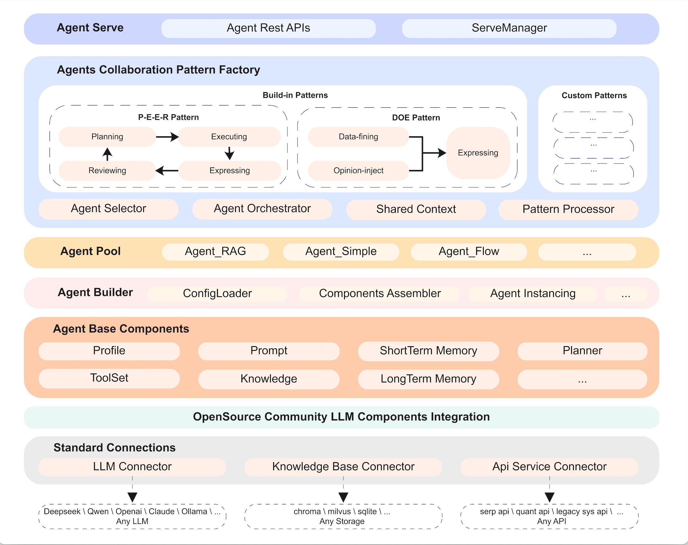
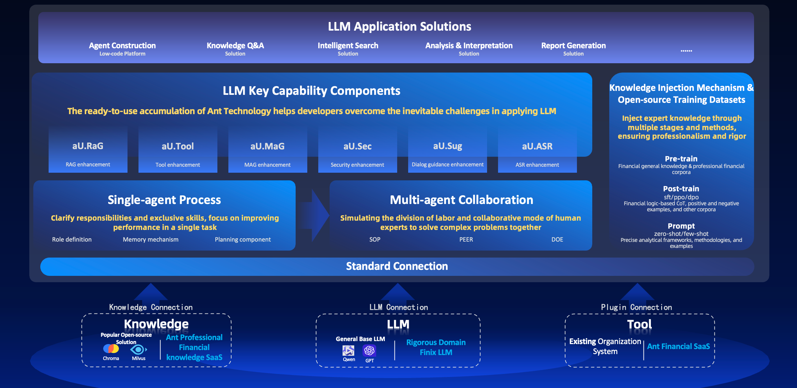

# agentUniverse
****************************************
Language version: [English](./README.md) | [中文](./README_zh.md) | [日本語](./README_jp.md)


[](LICENSE)
[](https://pypi.org/project/agentUniverse/)


****************************************

## What is agentUniverse?

**agentUniverse is a multi-agent framework based on large language models.** It provides flexible and easily extensible capabilities for building individual agents. The core of agentUniverse is a rich set of multi-agent collaborative pattern components (serving as a collaborative pattern factory), which allows agents to perform their respective duties and maximize their capabilities when solving problems in different fields; at the same time, agentUniverse focuses on the integration of domain experience, helping you smoothly integrate domain experience into the work of intelligent agents.🎉🎉🎉

**🌈🌈🌈agentUniverse helps developers and enterprises easily build powerful agents at the domain expert level to work collaboratively for you.**



We look forward to your practice and communication and sharing of Patterns in different fields through the community. This framework has already placed many useful components that have been tested in real business scenarios in terms of multi-agent cooperation, and will continue to be enriched in the future.
The pattern components that are currently open for use include:

* PEER pattern component: This pattern uses agents with different responsibilities—Plan, Execute, Express, and Review—to break down complex problems into manageable steps, execute the steps in sequence, and iteratively improve based on feedback, enhancing the performance of reasoning and analysis tasks. Typical use cases: Event interpretation, industry analysis.
* DOE pattern component: This pattern employs three agents—Data-fining, Opinion-inject, and Express—to improve the effectiveness of tasks that are data-intensive, require high computational precision, and incorporate expert opinions. Typical use cases: Financial report generation.

More patterns are coming soon...

The LLM model integration can be accomplished with simple configuration, currently agentUniverse supported models include:

||Vendors|Models|
|:-----:|:--------:|:------:|
||Qwen|qwen2.5-72b-instruct、qwq-32b-preview、qwen-max、…|
||Deepseek|deepseek-r1、deepseek-v3、deepseek-r1-distill-qwen-32b、…|
||OpenAI|GPT-4o、GPT-4o mini、OpenAI o1、OpenAI o3-mini、…|
||Claude|Claude 3.5 Sonnet、Claude 3 Opus、…|
||Gemini|Gemini 2.0 Flash、Gemini 2.0 Flash Thinking、Gemini 1.5 Pro、…|
||Llama|llama3.3-70b-instruct、llama3.2-3b-instruct、llama3.2-1b-instruct、…|
||KIMI|moonshot-v1-128k、moonshot-v1-32k、moonshot-v1-8k、…|
||WenXin|ERNIE 4.0、ERNIE 4.0 Turbo、ERNIE 3.5、…|
||chatglm|chatglm3-6b、chatglm-6b-v2、…|
||BaiChuan|baichuan2-turbo、baichuan2-13b-chat-v1、…|
||Doubao|Doubao-pro-128k、Doubao-pro-32k、Doubao-lite-128k、…|

For example, to use deepseek model, you can simply set DEEPSEEK_API_KEY value in the custom_key.toml file, and set the llm_model name in the agent configuration file to 'default_deepseek_llm' and you're all set. For more infomation about llm configuration, please refer to [switch-the-llm](https://github.com/antgroup/agentUniverse/blob/master/docs/guidebook/en/Get_Start/2.Run_Your_First_Tutorial_Example.md#switch-the-llm).


****************************************

## Citation

The agentUniverse project is supported by the following research achievements.

BibTeX formatted
```text
@misc{wang2024peerexpertizingdomainspecifictasks,
      title={PEER: Expertizing Domain-Specific Tasks with a Multi-Agent Framework and Tuning Methods}, 
      author={Yiying Wang and Xiaojing Li and Binzhu Wang and Yueyang Zhou and Han Ji and Hong Chen and Jinshi Zhang and Fei Yu and Zewei Zhao and Song Jin and Renji Gong and Wanqing Xu},
      year={2024},
      eprint={2407.06985},
      archivePrefix={arXiv},
      primaryClass={cs.AI},
      url={https://arxiv.org/abs/2407.06985}, 
}
```
Overview: This document introduces in detailed the mechanisms and principles underlying the PEER multi-agent framework. The experimental section assigned scores across seven dimensions: completeness, relevance, conciseness, factualness, logicality, structure, and comprehensiveness, with a maximum score of 5 points for each dimension. On average, the PEER model scored higher in each evaluation dimension compared to BabyAGI, and show notable advantages particularly in completeness, relevance, logicality, structure, and comprehensiveness. Furthermore, when tested with the GPT-3.5 Turbo (16k) model, the PEER model achieved a superior accuracy rate of 83% compared to BabyAGI, and with the GPT-4 model, it achieved an accuracy rate of 81%. For more details, please refer to the document. 
🔗https://arxiv.org/pdf/2407.06985

****************************************

## Table of Contents

* [Quick Start](#Quick-Start)  
* [How to build an agent application](#How-to-build-an-agent-application)
* [Setup the visual agentic workflow platform](#Setup-the-visual-agentic-workflow-platform)
* [Why use agentUniverse](#Why-use-agentUniverse)  
* [Sample Apps](#Sample-Apps)  
* [Documents](#Documents)  
* [Support](#Support)

****************************************
## Quick Start

### Installation
Using pip:
```shell
pip install agentUniverse
```
### Run the first example
Run your first example, and you can quickly experience the performance of the agents (or agent groups) built by agentUniverse through the tutorial.

Please refer to the document for detail steps: [Run the first example](docs/guidebook/en/Get_Start/2.Run_Your_First_Tutorial_Example.md) 。

****************************************

## How to build an agent application

### Standard Project Scaffolding
Setup the standard project: [agentUniverse Standard Project](examples/sample_standard_app)

#### Quick Start for Building a Single Agent
You can learn how to quickly build a single agent by reading the [Quick Guide to Build Single Agent](docs/guidebook/en/Get_Start/3.Quick_Guide_to_Build_Single_Agent.md). This will help you understand how to enhance your agent's capabilities using tools, knowledge bases, RAG technologies, and more. Additionally, you will grasp the basic application development processes for agents, including configuration, testing, optimizing, deployment, and performance evaluation. 

#### Building Typical Multi-Agent Applications
You can further understand how to break down intelligent capabilities into multiple agents in complex task scenarios and enhance your task performance through collaboration by referring to the [Building Typical Multi-Agent App](docs/guidebook/en/Get_Start/4.Building_Typical_Multi-Agent_App.md) chapter.

#### Creating and Using Agent Templates
You can learn how to create effective agent patterns into templates through the chapter [Creating and Using Agent Templates](docs/guidebook/en/Get_Start/5.Creating_and_Using_Agent_Templates.md). This will greatly enhance the efficiency of constructing subsequent agents and facilitate dissemination.

#### Other Tips and Techniques
You can learn more tips and techniques during the process of building intelligent agent applications in the chapter [Other_Tips_and_Techniques](docs/guidebook/en/Get_Start/6.Other_Tips_and_Techniques.md), such as how to add a memory module into the intelligent agent process and how to effectively manage prompts within the project.

****************************************

## Setup the visual agentic workflow platform

agentUniverse provides a visual canvas platform for creating agentic workflow. Follow these steps for a quick start:

**Using pip**
```shell
pip install magent-ui ruamel.yaml
```

**One-click Run**

Run [product_application.py](examples/sample_standard_app/bootstrap/platform/product_application.py) in sample_standard_app/bootstrap/platform for quick startup.

For more details, refer to [Quick Start for Product Platform](docs/guidebook/en/How-to/Guide to Visual Agentic Workflow Platform/Product_Platform_Quick_Start.md) and the [Advanced Guide](docs/guidebook/en/How-to/Guide to Visual Agentic Workflow Platform/Product_Platform_Advancement_Guide.md).

This feature is jointly developed by [difizen](https://github.com/difizen/magent) and agentUniverse.

****************************************

## Why use agentUniverse

### Concept


The core of agentUniverse provides all the essential components needed to build a single intelligent agent, the collaboration mechanisms between multiple agents, and allows for the injection of expert knowledge. The enables developers to effortlessly create intelligent applications equipped with professional know-how.

### Multi Agent Collaboration
AgentUniverse offers several multi-agent collaboration model components that have been validated in real-world industries. Among these, the "PEER" model stands out as one of the most distinctive.

The PEER model utilizes agents with four distinct responsibilities: Planning, Executing, Expressing, and Reviewing. This structure allows for the decomposition and step-by-step execution of complex problems and enables autonomous iteration based on evaluation feedback, ultimately enhancing performance in reasoning and analytical tasks. This model is particularly effective in scenarios that require multi-step decomposition and in-depth analysis, such as event interpretation, macroeconomic analysis, and the feasibility analysis of business proposals.

The PEER model has achieved impressive results, and the latest research findings and experimental data can be found in the following literature.

### Key Features
Based on the above introduction, we summarize the main features of agentUniverse as follow:

Flexible and Extensible Agent Construction Capability: It provides all the essential components necessary for building agents, all of which support customization to tailor user-specific agents.

Rich and Effective Multi-Agent Collaboration Models: It offers collaborative models such as PEER (Plan/Execute/Express/Review) and DOE (Data-finding/Opinion-inject/Express), which have been validated in the industry. Users can also customize and orchestrate new models to facilitate organic collaboration among multiple agents.

Easy Integration of Domain Expertise: It offers capabilities for domain prompts, knowledge construction, and management, enabling the orchestration and injection of domain-level SOPs, aligning agents with expert-level domain knowledge.

💡 For additional features:
see the section on [key features of agentUniverse](docs/guidebook/en/Concepts/Core_Features.md) for more details.

****************************************

## Sample Apps

🚩 [Legal Advice Agent v2](docs/guidebook/en/Examples/Legal_Advice.md)

🚩 [Python Code Generation and Execution Agent](docs/guidebook/en/Examples/Python_Auto_Runner.md)

🚩 [Discussion Group Based on Multi-Turn Multi-Agent Mode](docs/guidebook/en/Examples/Discussion_Group.md)

🚩 [Financial Event Analysis Based on PEER Multi-Agent Mode](docs/guidebook/en/Examples/Financial_Event_Analysis.md)

🚩 [Andrew Ng's Reflexive Workflow Translation Agent Replication](docs/guidebook/en/Examples/Translation_Assistant.md)

****************************************

## Commercial Product base on agentUniverse

🔗 [_Zhi Xiao Zhu_-AI Assistant for Financial Professionals](https://zhu.alipay.com/?from=au)

**_Zhi Xiao Zhu_ AI Assistant: Designed to facilitate the development of large models in rigorous industries to enhance the productively of investment research experts**

_Zhi Xiao Zhu_ AI Assistant an efficient solution for the practical application of large models in rigorous industries. It is built upon the Finix model, which emphasizes precise applications, and leverages the agentUniverse intelligent agent framework, known for its professional customization capabilities. This solution targets a range of professional AI business assistants related to investment research, ESG (environmental, social, and governance), finance, earnings reports, and other specialized domains. It has been extensively validated in large-scale scenarios at Ant Group, significantly improving expert efficiency.

https://private-user-images.githubusercontent.com/39180831/355437700-192f712d-1b03-46a6-8422-1ca10aa94331.mp4?jwt=eyJhbGciOiJIUzI1NiIsInR5cCI6IkpXVCJ9.eyJpc3MiOiJnaXRodWIuY29tIiwiYXVkIjoicmF3LmdpdGh1YnVzZXJjb250ZW50LmNvbSIsImtleSI6ImtleTUiLCJleHAiOjE3MjI5NDk4NTAsIm5iZiI6MTcyMjk0OTU1MCwicGF0aCI6Ii8zOTE4MDgzMS8zNTU0Mzc3MDAtMTkyZjcxMmQtMWIwMy00NmE2LTg0MjItMWNhMTBhYTk0MzMxLm1wND9YLUFtei1BbGdvcml0aG09QVdTNC1ITUFDLVNIQTI1NiZYLUFtei1DcmVkZW50aWFsPUFLSUFWQ09EWUxTQTUzUFFLNFpBJTJGMjAyNDA4MDYlMkZ1cy1lYXN0LTElMkZzMyUyRmF3czRfcmVxdWVzdCZYLUFtei1EYXRlPTIwMjQwODA2VDEzMDU1MFomWC1BbXotRXhwaXJlcz0zMDAmWC1BbXotU2lnbmF0dXJlPTU4NWMzNzVjOGZjZDNjMDMzMTE4YjQzOTk0ZWQwZGZkNWNmNWQxNWMzYWIzMTk4MzY1MjA5NWRhMjU2NGNiNzUmWC1BbXotU2lnbmVkSGVhZGVycz1ob3N0JmFjdG9yX2lkPTAma2V5X2lkPTAmcmVwb19pZD0wIn0.q1vdSg_Ghxr-DHLXfmQ_fVVRVSFn7H8VMHMi-_2QrjA

****************************************

## Documents

### User Guide
💡 For more detailed information, please refer to the [User Guide](./docs/guidebook/en/Contents.md).

### API Reference
💡 Please consult the [API Reference](https://agentuniverse.readthedocs.io/en/latest/) for technical details.

****************************************

## Support

### Submit Questions via GitHub Issues
😊 We recommend submitting your queries using [GitHub Issues](https://github.com/antgroup/agentUniverse/issues), we typically respond within 2 business days.

### Contact Us via Discord
😊 Join our [Discord Channel](https://discord.gg/DHFcdkWAhn) to interact with us.

### Contact Us via Administrator Email
😊 Email: 
* [jihan.hanji@antgroup.com](mailto:jihan.hanji@antgroup.com)
* [jerry.zzw@antgroup.com](mailto:jerry.zzw@antgroup.com)
* [jinshi.zjs@antgroup.com](mailto:jinshi.zjs@antgroup.com)

### twitter
ID: [@agentuniverse_](https://x.com/agentuniverse_)

### Acknowledgements

This project is partially built upon excellent open-source projects such as Langchain, Pydantic, Gunicorn, Flask, SQLAlchemy, chromadb, etc. (The detailed dependency list can be found in pyproject.toml). We would like to express our heartfelt gratitude to the related projects and their contributors. 🙏🙏🙏
