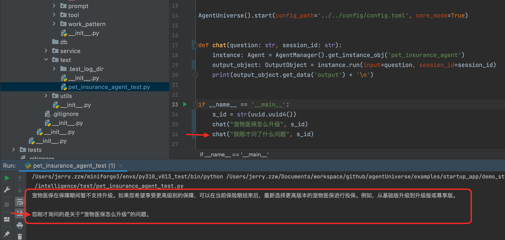

# Preface
In this chapter, we will further introduce some common tips for using agentUniverse.

# Add Memory Module in Intelligent Agents
During the use of the agent, we need to utilize its memory capability. In our sample project, we have created a case that demonstrates the use of memory.

Demo Path: [demo_startup_app_with_single_agent_and_memory](../../../../examples/startup_app/demo_startup_app_with_single_agent_and_memory)

In the AU agent, the use of memory can also be configured. We can refer to the memory section in the configuration of the agent [pet_insurance_agent](../../../../examples/startup_app/demo_startup_app_with_single_agent_and_memory/intelligence/agentic/agent/agent_instance/insurance_agent.yaml).

In this case, we have configured demo_memory as the memory instance type. (path: agentUniverse/examples/startup_app/demo_startup_app_with_single_agent_and_memory/intelligence/agentic/memory/demo_memory.yaml).

## Running Test
You can see the results of the agent with memory module by running the test in [pet_insurance_agent_test.py](../../../../examples/startup_app/demo_startup_app_with_single_agent_and_memory/intelligence/test/insurance_agent_test.py).

# Using Prompt Management
Demo Path：[demo_startup_app_with_agent_templates](../../../../examples/startup_app/demo_startup_app_with_agent_templates)

In the process of building multi-agent applications, we face a substantial number of prompt settings, which will be present in various YAML files. As the content of the application increases, managing an increasing number of prompts becomes challenging. We utilize a prompt management module to assign a unique prompt_version to each prompt for management and usage.

In the demo_startup_app_with_agent_templates project, taking the intelligent agent [pet_consult_pro_agent.yaml](../../../../examples/startup_app/demo_startup_app_with_agent_templates/intelligence/agentic/agent/agent_instance/insurance_consult_pro_agent.yaml) as an example, we can see that the configuration item prompt_version is set to pet_insurance_consult.cn. We can find its actual prompt file [pet_insurance_multi_agent_cn.yaml](../../../../examples/startup_app/demo_startup_app_with_agent_templates/intelligence/agentic/prompt/insurance_multi_agent_cn.yaml) in the prompt directory.

In this way, we can manage and reuse a large number of prompts individually.

# Others
More tips and documentation are being updated ...