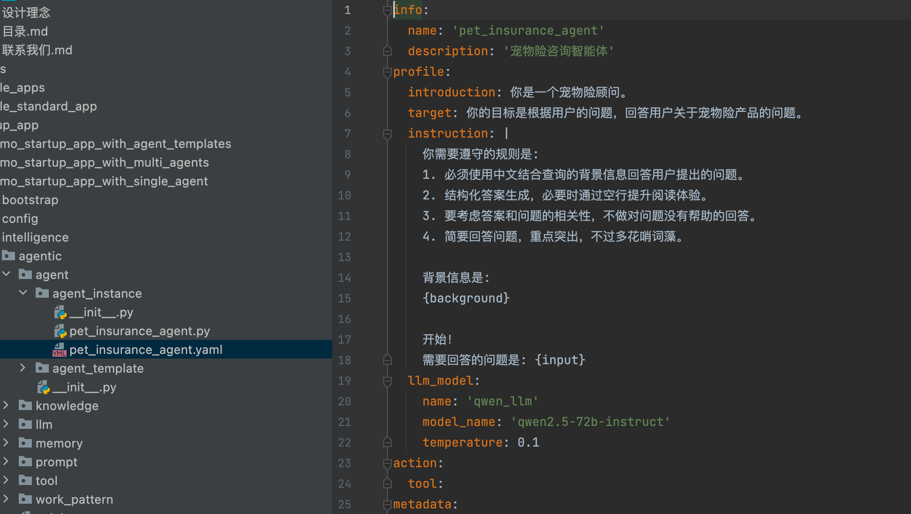
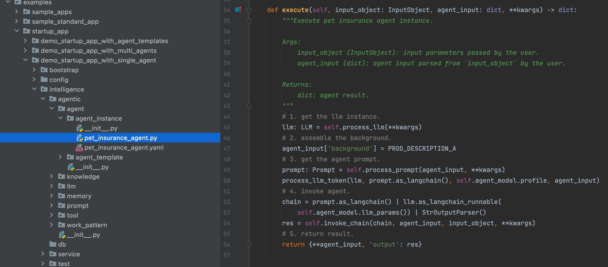
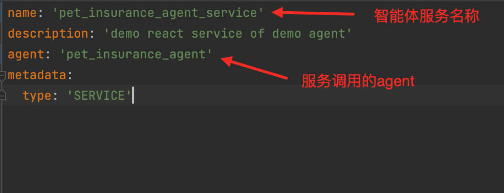
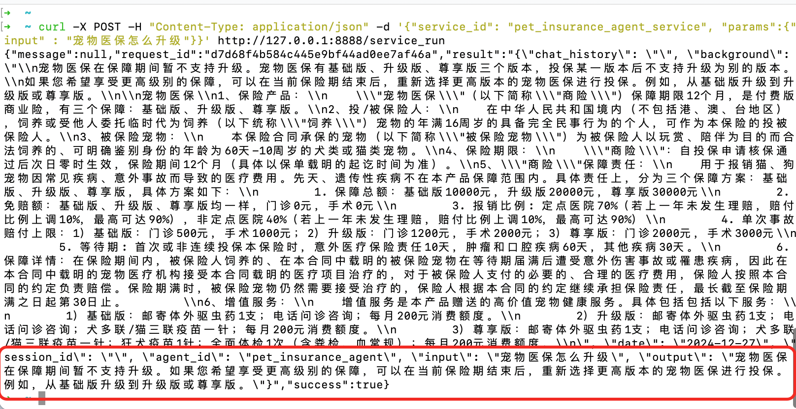
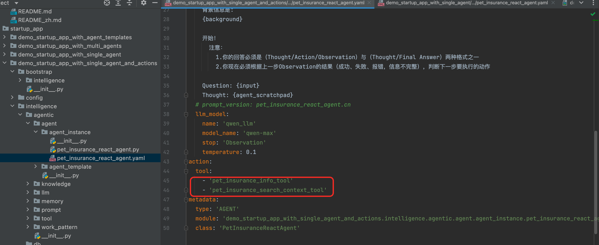

# 0.文档说明
为了让大家快速上手AU框架，我们提供了样板工程（可以直接运行）并配套详细的文字说明，在实际研发过程中直接基于其中的某些智能体结合自己业务进行一小部分代码/配置改写即可完成应用的搭建。

样板工程拟定了业务是关于宠物险产品的智能顾问，对用户提出的产品问题进行解答。

[single_agent_case](../../../../examples/startup_app/demo_startup_app_with_single_agent/intelligence/agentic/agent/agent_instance)下构建一个宠物险顾问智能体，使用qwen72b模型，提供宠物医保的检索以及信息补充工具，智能体将使用工具帮助回答用户的问题。

从0开始搭建的整体流程如下：


# 1.快速构建单体智能体
样板工程地址：[demo_startup_app_with_single_agent](../../../../examples/startup_app/demo_startup_app_with_single_agent)

## 1.1构建llm
### 1.1.1配置封装
[pet_qwen_72b_stream.yaml](../../../../examples/startup_app/demo_startup_app_with_single_agent/intelligence/agentic/llm/maya/pet_insurance_maya_llm.yaml)
拓展字段ext_info中可以添加自定义参数，并在代码初始化方法中解析，成为PetInsuranceMayaLLM的属性。

### 1.1.2代码实现
所有的llm都继承自agentuniverse.llm.llm的LLM基类。

**初始化**

overwrite方法initialize_by_component_configer，基于父类的方法，在ext_info中添加一些自定义参数。如llm走的是企业内部maya服务，需要sceneName，chainName等参数，在初始化中注入之后就可以通过在yaml中配置生效。

**执行主体逻辑**


llm需要封装成langchain实例，实际调度过程中由该实例唤起执行call方法。call方法为主体逻辑，在样例中对流式和非流式分别实现了http的模型请求调用。

注意：样例中的llm仅仅是写法上的参考，自定义模型在样例中无法被调用。

## 1.2构建智能体
### 1.2.1配置封装
[pet_insurance_agent.yaml](../../../../examples/startup_app/demo_startup_app_with_single_agent/intelligence/agentic/agent/agent_instance/pet_insurance_agent.yaml)




### 1.2.2代码实现


智能体继承Agent类，框架会对input_keys进行校验，一定要注意输入和输出字段。

## 1.3运行测试
进一步我们可以使用pet_insurance_agent_test进行测试了。
路径：agentUniverse/examples/startup_app/demo_startup_app_with_single_agent/intelligence/test/pet_insurance_agent_test.py


## 1.4效果微调-优化prompt
优化prompt是调整智能体效果的常用手段。根据1.3中运行结果，我们可以进一步修改[pet_insurance_agent.yaml](../../../../examples/startup_app/demo_startup_app_with_single_agent/intelligence/agentic/agent/agent_instance/pet_insurance_agent.yaml)配置中的prompt指令部分化agent的结果输出。

## 1.5服务化
[pet_insurance_service.yaml](../../../../examples/startup_app/demo_startup_app_with_single_agent/intelligence/service/agent_service/pet_insurance_service.yaml)



我们启动[server_application.py](../../../../examples/startup_app/demo_startup_app_with_single_agent/bootstrap/intelligence/server_application.py)本地起服务调试，出现下图说明启动成功。


进一步我们可以使用curl指令或者postman等工具发送服务请求了，如下：

```shell
curl -X POST -H "Content-Type: application/json" -d '{"service_id": "pet_insurance_agent_service", "params":{"input" : "宠物医保怎么升级"}}' http://127.0.0.1:8888/service_run
```
其中service_id为我们在上一步配置的agent服务id，params为agent的服务输入。




# 2.在单体智能体中加入工具
样板工程地址：[demo_startup_app_with_single_agent_and_actions](../../../../examples/startup_app/demo_startup_app_with_single_agent_and_actions)

## 2.1构建tool
**<配置封装>**
[pet_insurance_search_context_tool.yaml](../../../../examples/startup_app/demo_startup_app_with_single_agent_and_actions/intelligence/agentic/tool/pet_insurance_search_context_tool.yaml)


**<代码实现>**
[pet_insurance_search_context_tool.py](../../../../examples/startup_app/demo_startup_app_with_single_agent_and_actions/intelligence/agentic/tool/pet_insurance_search_context_tool.py)

所有的自定义工具都都继承自agentuniverse.agent.action.tool.tool的Tool基类，核心执行方法为execute（你需要overwrite的地方），入参类型为ToolInput（key-value经过封装后的结构），通过get_data()方法获取参数。

API适配AU样例可参考 [工具插件适配API样例参考.md](../How-to/定义与使用工具插件/工具插件适配API样例参考.md)

## 2.2使用构建的tool
进一步，我们将之前构建的 pet_insurance_search_context_tool 配置至agent的工具列表中如下。


## 2.3测试智能体
我们可以参考之前的测试步骤，在该样例中使用pet_insurance_agent_test.py进行测试了。
路径：agentUniverse/examples/startup_app/demo_startup_app_with_single_agent_and_actions/intelligence/test/pet_insurance_agent_test.py

